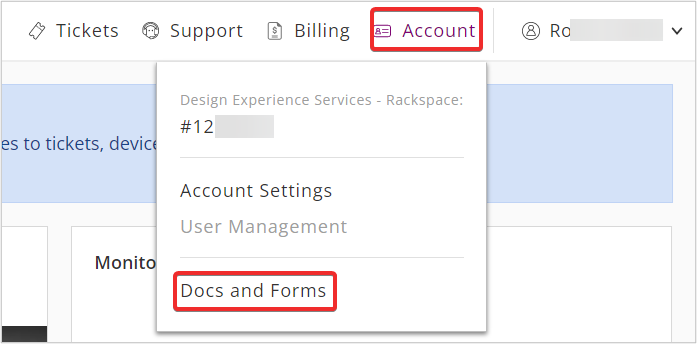
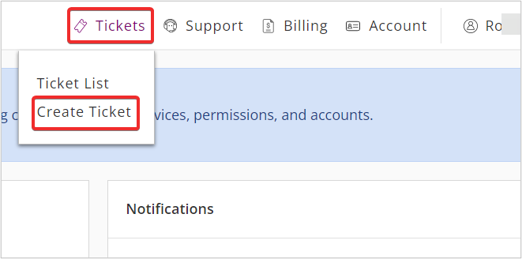

Complete a **Service Transfer** form if your company has filed for a
name change with the Secretary of State where the company is registered,
and the tax ID is changed.

You can download the **Service Transfer** form by using the following
steps:

**Note** If you are a Private Cloud customer, you can request all of the
forms described in this guide from your Account Manager.

**Step 1.** Log in to the [Rackspace Technology Customer
Portal](https://login.rackspace.com/).

**Step 2.** In the top navigation panel, select **Account \>\> Docs and
Forms**.

{width="349px"}

**Step 3.** In the **Documents and Forms** page, select the appropriate
options below **Transfer Ownership to a new Account owner**:

> -   Fanatical Support for AWS customer, download the **Fanatical
>     Support for AWS Service Transfer Form**.
> -   Other customers, download the **Service Transfer Form**.

**Step 4.** Complete the downloaded form and save the edited file on
your computer.

**Step 5.** Return to the [Rackspace Technology Customer
Portal](https://login.rackspace.com/).

**Step 6.** Select **Tickets** \> **Create Ticket** from the top
navigation panel.

{width="331px"}

**Step 6.** In **Create Ticket** page, select the appropriate
**Category** from Category section and click **Continue**.

{width="470px"}

**Step 7.** In **Account & Product** section, click **drop-down** and
select the appropriate **Account**, **Product**, and **Severity** and
click **Continue** as shown in the below image.

{width="380px"}

**Step 8.** In **Issue Details** section, fill in details of Subject,
Description, and Recipient(s). Upload the **Account Change Form** as
attachments with **Company Name Change Request** in the subject line and
click **Submit**. Your ticket will be created.

{width="379px"}

# Name change without a new tax ID or ownership

If the company name has changed but the tax ID or ownership did not
change, you must complete one of the following forms to provide evidence
of the name change.

These forms are available from the **Secretary of State**.

-   Certificate of Name Change
-   Certificate of Amendment
