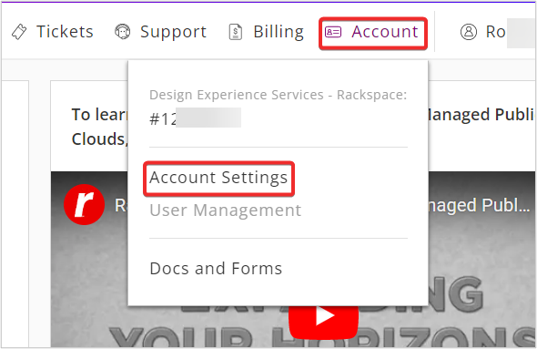
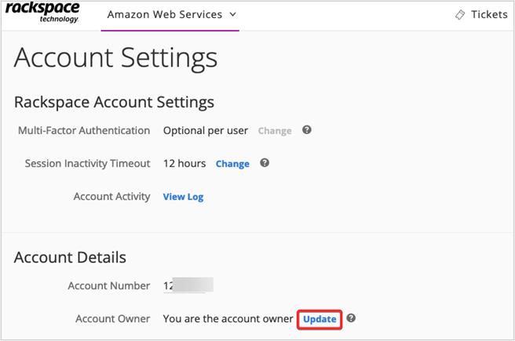
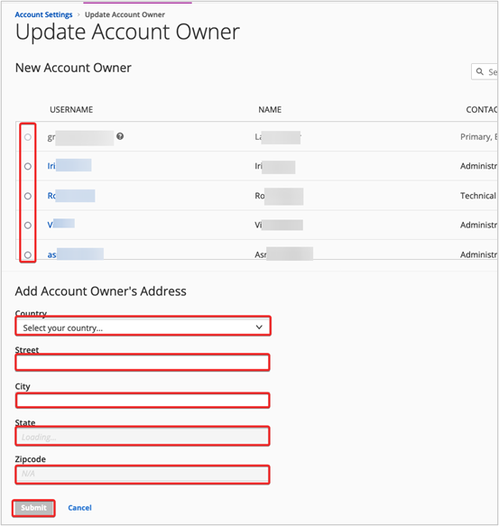
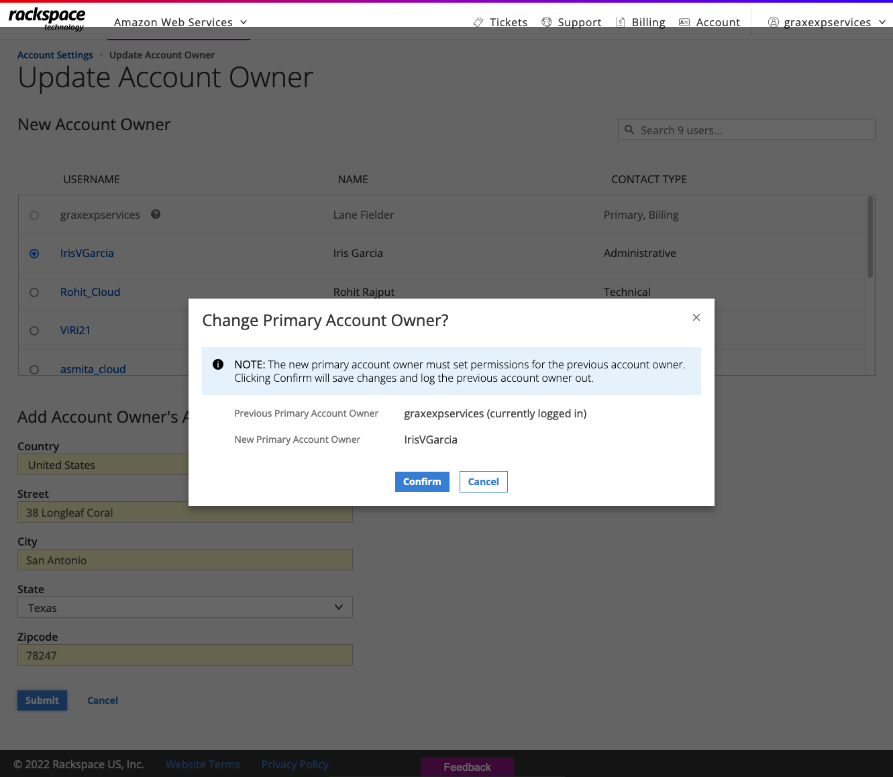

.. _change_cloud_account_owner:

===================================
Change your Cloud Account Owner
===================================

When a Primary User/Account Owner leaves the company or the name of the company or
project changes, then you need to change the Primary User/Account Owner. 
To Update this information for
your Rackspace Technology Cloud and Amazon Web Services® (AWS)
accounts, Login to `Rackspace Technology Customer Portal <https://login.rackspace.com>`_.

**Note: Only the current Account Owner can assign a New Account Owner.**

**When you Change the Account Owner**:

- You must select the new or promoted user
  from existing users on the account. 

- The selected user becomes the Primary Contact and has full control over the account.

- As the former or demoted primary user, you are set
  up as an Administrative contact type and given
  basic `Role-Based Access Control (RBAC)
  Identity permissions <https://developer.rackspace.com/docs/cloud-identity/v2/getting-started/>`_.
  The primary user might need to set up
  RBAC permissions for the demoted user.

You can **Change the Account Owner** by using the following steps:

**Step 1** Log in to the `Rackspace Technology Customer Portal <https://login.rackspace.com>`_.

**Step 2** In the global navigation menu, click **Account** >> **Account Settings**.

**Step 3** In Account Settings page, click **Update** next to **Account Owner**.

**Step 4** In Update Account Owner page, select a **User** from the User list to be assigned as New Account Owner. Fill in the address details of Account Owner and click **Submit**.

**Step 5** Click **Confirm** to change the **Primary Account Owner**.

